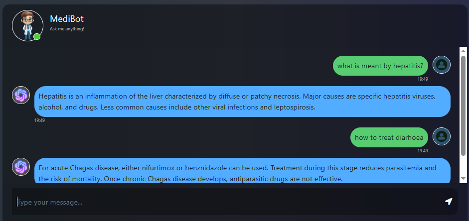

# Medical-Chatbot

# Demonstration 


# How to run?
### STEPS:

Clone the repository

```bash
Project repo: https://github.com/
```

### STEP 01- Create a conda environment after opening the repository

```bash
conda create -n mbt python=3.10 -y
```

```bash
conda activate mbt
```

### STEP 02- install the requirements
```bash
pip install -r requirements.txt
```

### Create a `.env` file in the root directory and add your Pinecone & openai
credentials as follows:

```ini
PINECONE_API_KEY = "xxxxxxxxxxxxxxxxxxxxxxxxxxxx"
OPENAI_API_KEY = "xxxxxxxxxxxxxxxxxxxxxxxxxxxx"
```

```bash
#run the following command to store embeddings to pinecone
python python store_index.py
```

```bash
#Then start the application by running
python app.py
```

finally,
```bash
open up localhost:
```

# Tech Stack

- **Python 3.10**  
  Used as the primary programming language for this chatbot.

- **Flask**  
  A lightweight web framework to serve the chatbot application.

- **LangChain**  
  Provides composable components for constructing LLM-powered workflows.

- **Pinecone**  
  Hosts vector embeddings and handles similarity search.

- **HuggingFace Embeddings**  
  Creates vector representations (embeddings) of text.

- **Google Generative AI**  
  Language model used for generating conversation responses.

- **Conda & Pip**  
  Environment and package management tools.